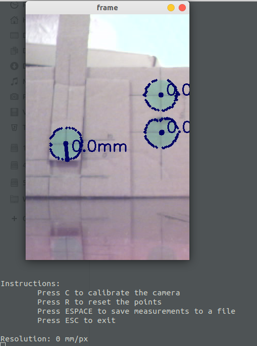
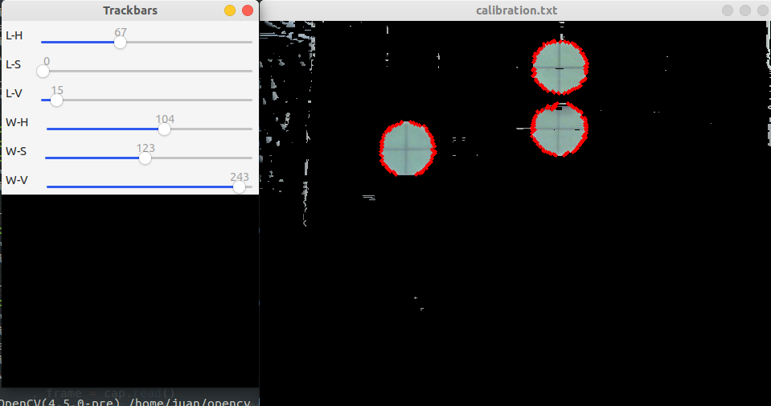
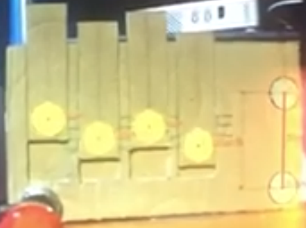
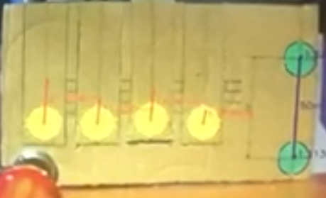

# BendingTest

A project created to measure displacements with a camera of a vehicle chassis using marker points. It may be used for other purposes


## Getting Started

### Dependencies

* The code needs Python 3.x.x to run
* The project was built in Ubuntu Linux 18.04, but other OS may work
* OpenCV is needed for the scripts to launch

### Executing program

* Run the main script and the different command options will appear on the terminal. 
```
python3 BendingTest.py
```
* By default, it will use whichever camera is set to port 0. If the user wants to use another port, it may be specified as an argument

```
python3 BendingTest.py 1
```

When running the program, the first thing the user has to do is to calibrate the colors for the markers. A template can be found in assets/Grid.png, containing markers of different colors. 
Depending on the camera used, the lighting conditions and the printing of the markers, different configurations may be needed.
To achieve the calibration, the C key has to be pressed in the main terminal.



In the calibration mode, there will be some trackbars that allow the user to filter out every color that does not belong to the markers. When the trackbars are set and only the markers are detected, press "ESC" and the settings will be saved in the *calibration* folder.
The first calibration is for the green markers, and the second for the yellow markers (they are called as so in order to differentiate them, but the markers may be of any desired color).



The markers configured as "green" will be fixed at a known distance. They are used as a *ground truth* to compute the distance traveled by the markers configured as "yellow".

After setting up the calibration, it is recommended to execute the "R" (reset) command to remove the noise. 

By defaut, the green markers should be set appart 20mm at all times, and the distance completed by the yellow markers will appear updated on the screen. If the user wants to save the data at a specific time, "SPACE" may be pressed and the information will be stored in a *calibration.txt* file. 





At any point of the execution, the "R" command can be pressed and the measurements on screen will reset.

## Authors

Juan Segura (juanseguranunez@gmail.com)

## Version History

* 0.1
    * Initial Release

## License

This project is free to use by any individual or organization